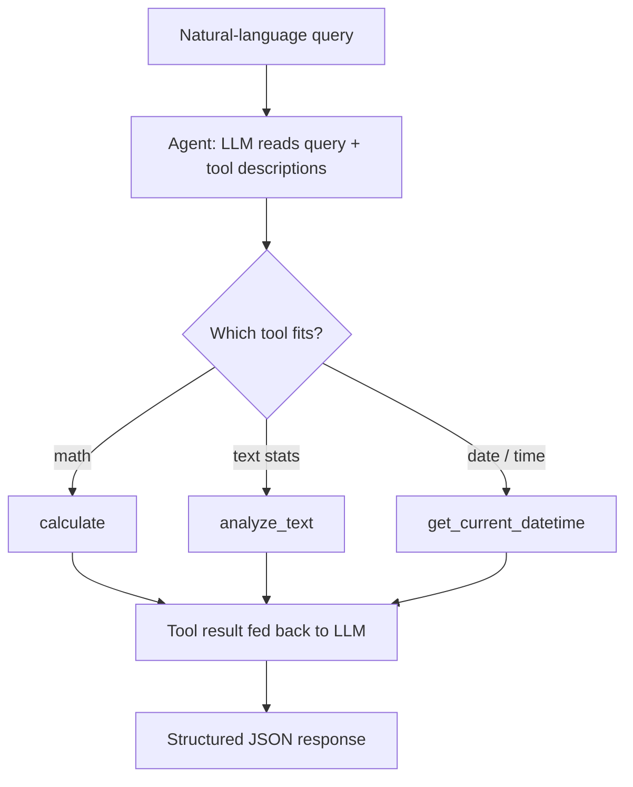

# Multi-Tool AI Agent API

A FastAPI service that wraps a LangChain agent which **decides on its own** which tool to use to answer a natural-language question, then returns a clean, structured JSON response.

## The idea

A language model on its own can reason and explain beautifully, but it can't reliably *do* things. It can't compute exact arithmetic, it doesn't know the current time, and it can't act on the world around it: all it can do is talk.

It's like a brilliant new hire locked in a room with no phone, no calculator, and no clock. Ask them what time it is and they have no idea. Ask them what `1986 × 342` is and they'll give a confident guess, because they can't actually compute it.

To *do* things, the model needs tools. This project hands a model three tools and lets it decide, autonomously, which one each question needs. That decision-making ability is called **tool use**, and it's the core pattern behind production AI assistants.

## What it does

- Accepts a natural-language query over HTTP.
- An LLM agent decides whether a tool is needed and, if so, which one.
- Runs the chosen tool and uses its result to compose the final answer.
- Returns a structured JSON response, including which tools were used.
- Supports multi-turn conversations through session-based memory.

## How it works

The agent follows a three-step tool-calling loop:

1. **Tool binding:** each tool is a Python function with a clear name, typed arguments, and a description of what it does. These definitions are passed to the LLM so it knows what's available.
2. **Intent analysis:** when a query arrives, the LLM reads it and works out what's actually being asked (for example, numbers plus words like "multiply" signal a math task).
3. **Autonomous routing:** instead of answering directly, the LLM outputs a structured request naming the tool it wants and the arguments to pass. LangChain runs that tool and feeds the result back to the LLM, which then writes the final answer.



## Tech stack

| Layer | Technology |
| --- | --- |
| Web framework | FastAPI + Uvicorn |
| Request/response contracts | Pydantic v2 |
| Agent orchestration | LangChain v1 |
| LLM inference | Groq API (Llama 3.3 70B) |
| Language | Python 3.11 |

## Project structure

```
ai-agent-api/
├── main.py            # FastAPI app, endpoints, session memory
├── agent.py           # LangChain agent setup and invocation
├── tools.py           # The three tools the agent can call
├── schemas.py         # Pydantic request/response models
├── requirements.txt
└── .gitignore
```

## Getting started

### Prerequisites

- Python 3.11 or newer
- A free Groq API key from [console.groq.com](https://console.groq.com)

### Setup

```bash
git clone https://github.com/chamathka-00/multi-tool-ai-agent-api.git
cd multi-tool-ai-agent-api

python -m venv venv
venv\Scripts\activate          # Windows
# source venv/bin/activate     # macOS / Linux

pip install -r requirements.txt
```

### Add your API key

The key is read from an environment variable, so it never lives in the source code.

```bash
set GROQ_API_KEY=your-api-key-here       # Windows (Command Prompt)
# export GROQ_API_KEY=your-api-key-here  # macOS / Linux
```

### Run

```bash
uvicorn main:app --reload
```

Then open [http://localhost:8000/docs](http://localhost:8000/docs) for interactive Swagger documentation where you can try every endpoint.

## API endpoints

| Method | Endpoint | Purpose |
| --- | --- | --- |
| `GET` | `/health` | Health check: confirms the server is running |
| `POST` | `/agent/query` | Send a query to the agent |
| `DELETE` | `/agent/sessions/{session_id}` | Clear a conversation's memory |

### Example query

Request to `POST /agent/query`:

```json
{
  "query": "What is 25 * 17 + 3?"
}
```

Response:

```json
{
  "answer": "428",
  "tools_used": ["calculate"],
  "model": "llama-3.3-70b-versatile",
  "session_id": "a1b2c3d4-..."
}
```

### Conversation memory

Pass the same `session_id` across requests and the agent remembers the earlier turns:

```json
{ "query": "What is 10 + 5?", "session_id": "demo" }
```
```json
{ "query": "Multiply that by 3", "session_id": "demo" }
```

The agent knows "that" refers to `15` from the first turn and returns `45`.

## Tools the agent can use

- **`calculate`:** safely evaluates a mathematical expression.
- **`analyze_text`:** returns word, character, and sentence counts for a piece of text.
- **`get_current_datetime`:** returns the current date and time.

## Error handling

The API uses standard HTTP status codes:

- **200:** successful response matching the schema.
- **422:** request failed validation (e.g. an empty query), handled automatically by Pydantic.
- **500:** the agent itself failed (e.g. the LLM API timed out or hit a rate limit).
- **404:** tried to clear a session that doesn't exist.

## Concepts demonstrated

- Autonomous tool selection (tool use) with a ReAct-style agent.
- Typed API contracts using Pydantic for predictable, self-documenting requests and responses.
- Structured JSON responses with proper HTTP status codes.
- Stateful, multi-turn conversation memory via session IDs.

## Possible extensions

- Swap the in-memory session store for Redis or a database so conversations survive a restart.
- Add tools that reach real data or take real actions: web search, weather, a database lookup, sending an email.
- Deploy the service so it's reachable beyond localhost.
